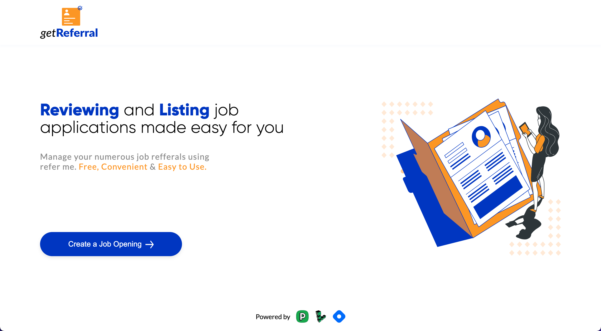
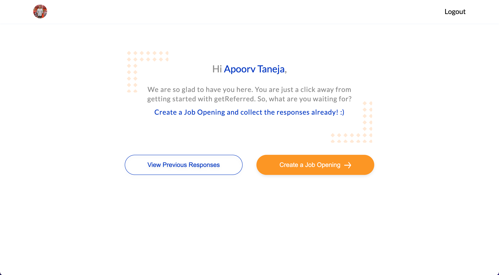
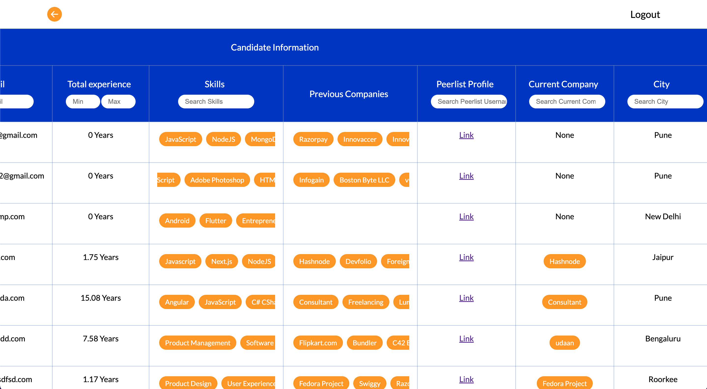

# getReferral 


A simplified and easy solution to manage the referrals. Don't let your DMs be flooded with so many resumes and messages. 

Filter out the profile and hire the best talents in the industry.


Apply with one click for any referral, and avoid filling out forms and sending emails with resumes.


**Free, convenient and easy to use.** ( Powered by Peerlist )

Link - https://get-referral.vercel.app/
### Key features

- Prevent a lot of DMs
- Chances to best profiles getting skipped **reduced**.
- **Filter profiles** with a lot of flexible parameters
- Reduce **duplicate entries**, saves time
- **Easy one-click apply** for candidates

### Upcoming features

- Feature to **bookmark profiles** in the response table to save them for future
- Dashboard for candidates to **view previous application**
- **Referral rate score** for job creators to get a better idea.
- Integration with **LinkedIn**


### Project setup
1. ```npm install```
  

2. Create an `.env` file and add the following variables.


    ```
    GOOGLE_ID=''
    GOOGLE_SECRET='
    MONGODB_URI=''
    LINKEDIN_ID=''
    LINKEDIN_SECRET=''
    ```

3. `npm run dev`
4. Open `http://localhost:3000/`


### Design Link

1. [Figma Link](https://www.figma.com/file/7mptGEX3U75LTnuZb8R8pA/Hackathon?node-id=20%3A33)


### Tech stack

 **Frontend**
 
 - NextJS
 - Styled-Components
 - Next-Auth
 - Radix-UI
 - React-Table

 **Backend**
 - MongoDB (By Linode)


### Dashboard
- Login Screen
  
- User Dashboard
  
- Response screen 
  
  

  <br/>

  **[Linode](https://www.linode.com/?utm_source=hashnode&utm_medium=article&utm_campaign=hackathon_announcement) X [Hashnode](https://hashnode.com/) Hackathon submission**


